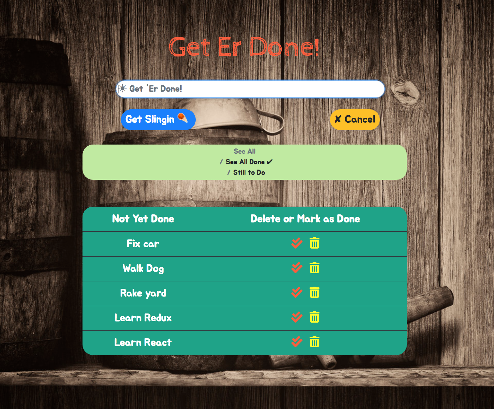
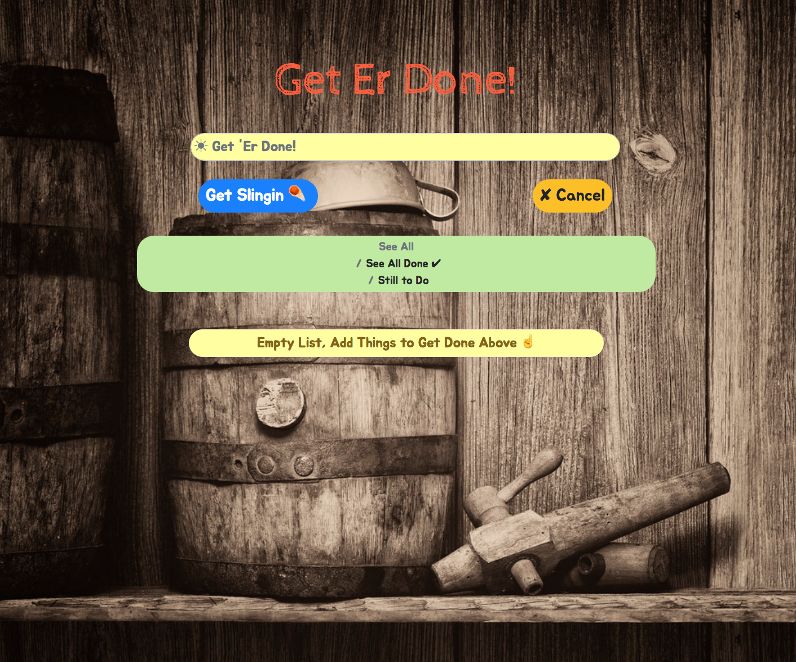

# [Get Er Done!](https://get-er-dun.herokuapp.com/) - REDUX / REACT JS
#### Please Click App Name Above to View Heroku Deployment

### Created Using REDUX and REACT JS
 

  

  

This project was bootstrapped with [Create React App](https://github.com/facebookincubator/create-react-app).

#### Technologies Used:
##### REDUX
##### REACT JS
##### Bootstrap
##### FontAwesome
##### Heroku

##### In this REDUX / REACT app users can build task lists and either mark them as done or simply delete them.

#### To see the app's Heroku deployment, click the app name/link above or you can view [here](https://get-er-dun.herokuapp.com/).

##### [Amit](https://amitzaman.com/)
